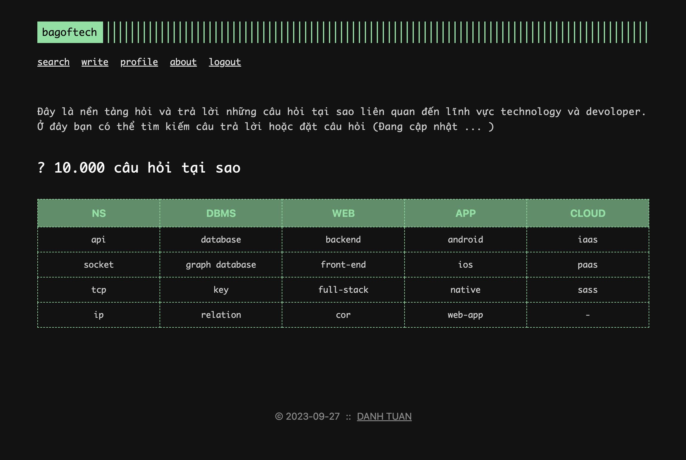
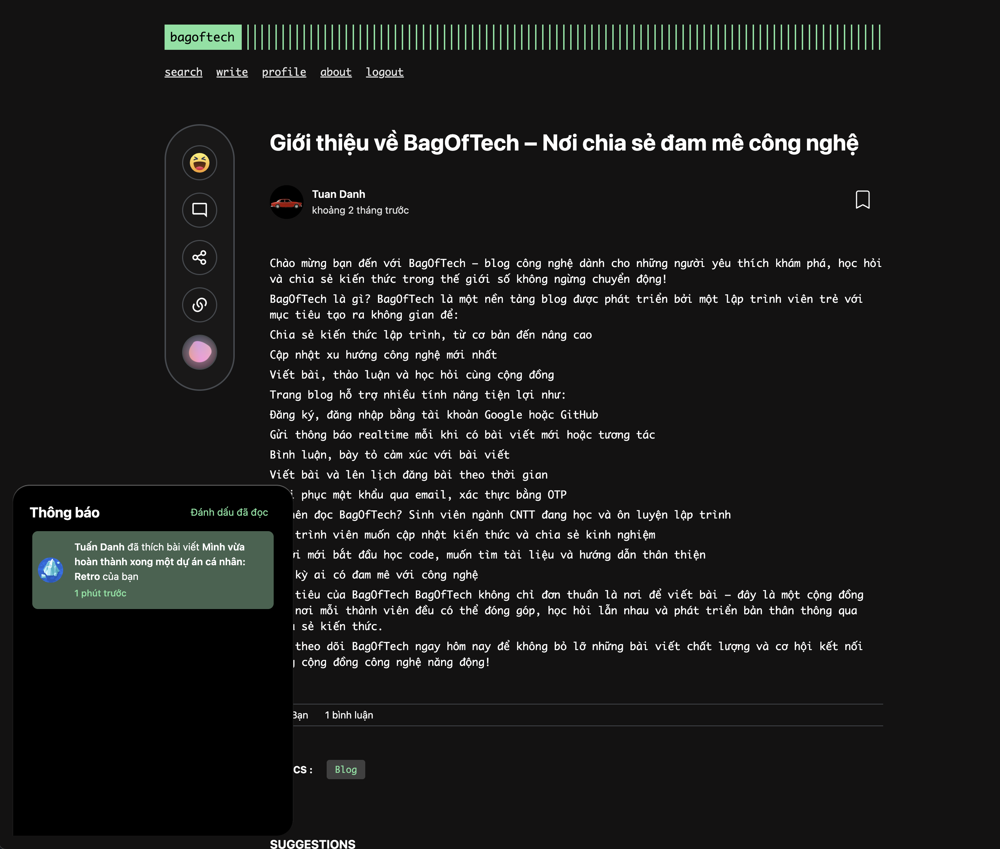

<br />

<div align="center">
  <a href="https://github.com/dt313/nextjs-retro-chat-app.git">
    
  </a>

<h3 align="center">Bagoftech</h3>

  <p align="center">
    <strong>BagOfTech</strong> is a modern blog platform focused on tech content.  
    It supports user authentication, post scheduling, comments, reactions, real-time notifications, and more — built with <strong>Next.js</strong>, <strong>Spring Boot</strong>, and <strong>WebSocket</strong>.
    <br />
    <br />
    <a href="https://bagoftech.vercel.app/">View Demo</a>
  </p>
</div>

---

## 🖼️ Screenshots




---

## 🚀 Features

-   ✅ Sign in / Sign up with **Google** & **GitHub**
-   ✅ Create, edit, and schedule blog posts
-   ✅ Markdown editor with preview
-   ✅ Comments & emoji reactions
-   ✅ Real-time notifications
-   ✅ Forgot password with email recovery
-   ✅ OTP verification via email
-   ✅ Light, Dark Theme - Primary color setting
-   ✅ Responsive UI for both mobile and desktop

---

## 🧑‍💻 Tech Stack

### 🖥️ Frontend

-   [Next.js](https://nextjs.org/)
-   React 18
-   Redux Toolkit
-   Axios
-   WebSocket

### 🔧 Backend

-   Spring Boot (Java)
-   Spring Security + JWT
-   Spring Data JPA + PostgreSQL
-   WebSocket (STOMP)
-   Java Mail Sender (OTP + Password Reset)
-   Redis

---

## 📦 Getting Started

### ⚙️ 1. Clone the repository

#### Front end

```bash
git clone https://github.com/dt313/reactjs-blog.git
cd reactjs-blog
```

```bash
npm install
```

**ENV SAMPLE**

```bash
REACT_APP_SOCKET="ws"
REACT_APP_API_URL="http://localhost:8080/api/v1"
REACT_APP_API_URL_BASE="http://localhost:8080"
REACT_APP_API_URL_ORIGIN="localhost:8080"
REACT_APP_ENV=local
```

**RUN**

```bash
npm run dev
```

#### Back end

```bash
git clone https://github.com/dt313/spring-blog.git
cd spring-blog
```

```bash
./mvnw clean install
```

**ENV SAMPLE**

```yml
server:
    port: 8080
    domain: ${LOCAL_SERVER_DOMAIN}
client:
    domain: ${LOCAL_CLIENT_DOMAIN}
spring:
    ai:
        ollama:
            base-url: http://127.0.0.1:11434/api/chat
            chat:
                options:
                    model: llama3.2

    data:
        redis:
            host: ${LOCAL_REDIS_HOST}
            port: 6379
    web:
        resources:
            static-locations: file:/uploads/images/

    mail:
        host: 'smtp.gmail.com'
        port: 587
        username: ${LOCAL_GMAIL_USER}
        password: ${LOCAL_GMAIL_PW}
        properties:
            mail:
                smtp:
                    auth: true
                    starttls:
                        enable: true

    application:
        name: 'blog-local-api'

    security:
        oauth2:
            client:
                registration:
                    google:
                        client-id: ${LOCAL_GG_ID}
                        client-secret: ${LOCAL_GG_SECRET}
                        redirect-uri: ${LOCAL_SERVER_ORIGIN}/oauth2/callback/google
                        scope:
                            - profile
                            - email
                    github:
                        clientId: ${LOCAL_GH_ID}
                        clientSecret: ${GH_LOCAL_SECRET}
                        redirect-uri: ${LOCAL_SERVER_ORIGIN}/oauth2/callback/github"
                    facebook:
                        clientId: ${LOCAL_FB_ID}
                        clientSecret: ${FB_SECRET}
                        scope:
                            - profile
                        redirect- uri: ${LOCAL_SERVER_ORIGIN}/oauth2/code/facebook"

    datasource:
        url: jdbc:${LOCAL_PG_URL}
        username: ${LOCAL_PG_USER}
        password: ${LOCAL_PG_PW}
        hikari:
            auto-commit: false

    jpa:
        hibernate:
            ddl-auto: update
        show-sql: true

jwt:
    signerKey: ${LOCAL_SIGNER_KEY}
    valid-duration: 3600
    refreshable-duration: 86400
    reset-password-key: ${LOCAL_REFRESH_KEY}
    reset-password-duration: 300
```

**RUN**

```bash
./mvnw spring-boot:run

```
